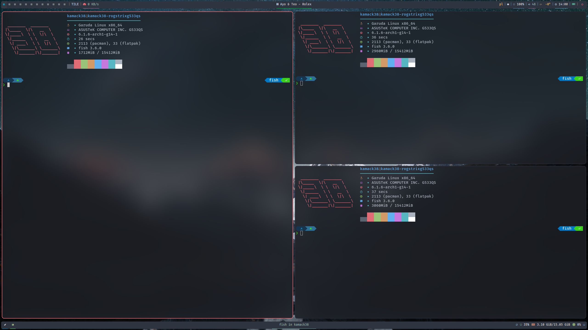
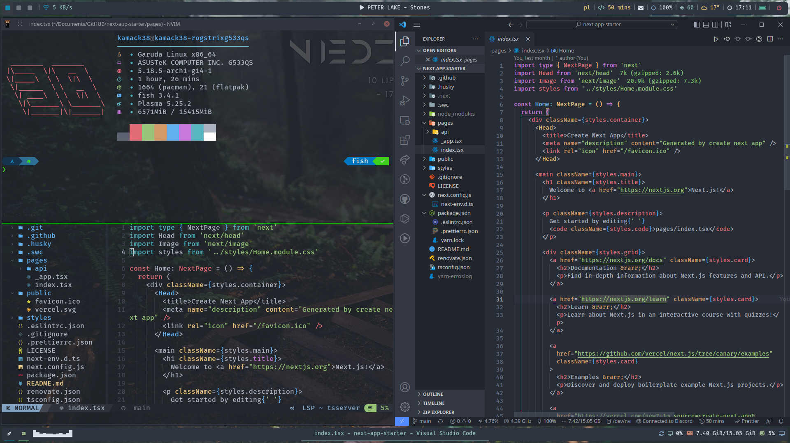

<h1 align="center">My .dotfiles for Arch Linux</h1>

## Installation

If you're looking for [Arch Linux Installation](#arch-linux-installation) go to the section below

```bash
bash <(curl -sL https://github.com/kamack38/dotfiles/raw/main/scripts/install.sh)
```

## Arch Linux Installation

To setup a brand new version of Arch Linux you can use the command below in an [ISO](https://archlinux.org/download/)

> **Warning**
>
> This script will delete all files from the selected disk

```bash
bash <(curl -sL https://github.com/kamack38/dotfiles/raw/main/scripts/setup.sh)
```

## Screenshots

### Hyprland


### AwesomeWM



### KDE


